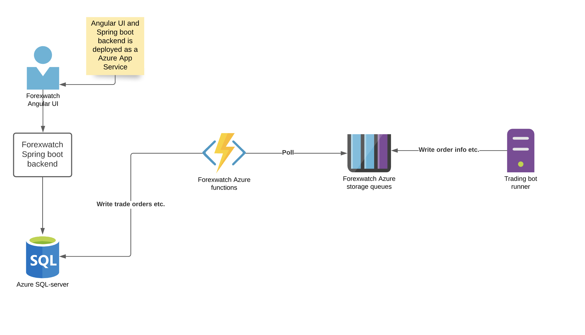

This project is my own hobby project which I use as a place to store my trading orders information. I have played with Forex trading (demo accounts) and this simple application is  a place where I store my trade orders and can monitor performance of those trading accounts.

Architecture:

To run docker image type :

docker run \
       -d --restart unless-stopped \
       -v /opt/strategies:/var/forexwatch/strategies \
       --privileged=true \
       --name forexwatch_runner \
       -p 8080:8080 \
       forexwatch_runner_image

Push docker image to private repository: 
  
    docker login --username tkatva --password ThePword
    docker tag my-image tkatva/katvasoft
    docker push tkatva/katvasoft
       
       
Run docker created docker image :

    docker run -d --restart unless-stopped -v /opt/strategies:/var/forexwatch/strategies --privileged=true --name forexwatch_runner -p 8080:8080 tkatva/katvasoft:latest
    
    
 Deploy to Azure : 
 
    mvn clean package azure-webapp:deploy